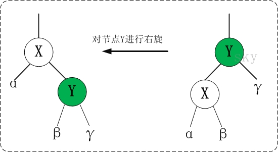
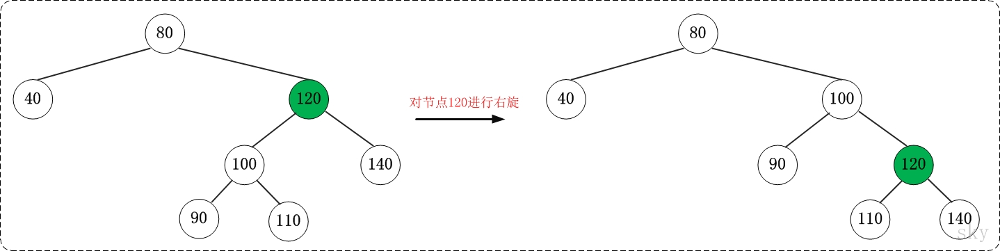

### **R-B Tree简介**

R-B Tree，全称是Red-Black Tree，又称为“红黑树”，它一种特殊的二叉查找树。红黑树的每个节点上都有存储位表示节点的颜色，可以是红(Red)或黑(Black)。 

**红黑树的特性**: 

**（1）每个节点或者是黑色，或者是红色。**

**（2）根节点是黑色。** 

**（3）每个叶子节点（NIL）是黑色。 [注意：这里叶子节点，是指为空(NIL或NULL)的叶子节点！]** 

**（4）如果一个节点是红色的，则它的子节点必须是黑色的。**

**（5）从一个节点到该节点的子孙节点的所有路径上包含相同数目的黑节点。** 

**注意**： (01) 特性(3)中的叶子节点，是只为空(NIL或null)的节点。 (02) 特性(5)，确保没有一条路径会比其他路径长出俩倍。因而，红黑树是相对是接近平衡的二叉树。 

红黑树示意图如下： 


### **红黑树的应用**

红黑树的应用比较广泛，主要是用它来存储有序的数据，它的时间复杂度是O(lgn)，效率非常之高。 例如，Java集合中的[TreeSet](http://www.cnblogs.com/skywang12345/p/3311268.html)和[TreeMap](http://www.cnblogs.com/skywang12345/p/3310928.html)，C++ STL中的set、map，以及Linux虚拟内存的管理，都是通过红黑树去实现的。 

### **红黑树的基本操作(一) 左旋和右旋**

红黑树的基本操作是**添加**、**删除**。在对红黑树进行添加或删除之后，都会用到旋转方法。为什么呢？道理很简单，添加或删除红黑树中的节点之后，红黑树就发生了变化，可能不满足红黑树的5条性质，也就不再是一颗红黑树了，而是一颗普通的树。而通过旋转，可以使这颗树重新成为红黑树。简单点说，旋转的目的是让树保持红黑树的特性。 旋转包括两种：**左旋** 和 **右旋**。下面分别对它们进行介绍。 


对x进行左旋，意味着"将x变成一个左节点"。


左旋的伪代码《算法导论》：参考上面的示意图和下面的伪代码，理解“红黑树T的节点x进行左旋”是如何进行的。

```c
LEFT-ROTATE(T, x)  
 y ← right[x]            // 前提：这里假设x的右孩子为y。下面开始正式操作
 right[x] ← left[y]      // 将 “y的左孩子” 设为 “x的右孩子”，即 将β设为x的右孩子
 p[left[y]] ← x          // 将 “x” 设为 “y的左孩子的父亲”，即 将β的父亲设为x
 p[y] ← p[x]             // 将 “x的父亲” 设为 “y的父亲”
 if p[x] = nil[T]       
 then root[T] ← y                 // 情况1：如果 “x的父亲” 是空节点，则将y设为根节点
 else if x = left[p[x]]  
           then left[p[x]] ← y    // 情况2：如果 x是它父节点的左孩子，则将y设为“x的父节点的左孩子”
           else right[p[x]] ← y   // 情况3：(x是它父节点的右孩子) 将y设为“x的父节点的右孩子”
 left[y] ← x             // 将 “x” 设为 “y的左孩子”
 p[x] ← y                // 将 “x的父节点” 设为 “y”
```

理解左旋之后，看看下面一个更鲜明的例子。你可以先不看右边的结果，自己尝试一下。 


**2. 右旋** 



对x进行左旋，意味着"将x变成一个左节点"。

右旋的伪代码《算法导论》：参考上面的示意图和下面的伪代码，理解“红黑树T的节点y进行右旋”是如何进行的。 

```c
RIGHT-ROTATE(T, y)  
 x ← left[y]             // 前提：这里假设y的左孩子为x。下面开始正式操作
 left[y] ← right[x]      // 将 “x的右孩子” 设为 “y的左孩子”，即 将β设为y的左孩子
 p[right[x]] ← y         // 将 “y” 设为 “x的右孩子的父亲”，即 将β的父亲设为y
 p[x] ← p[y]             // 将 “y的父亲” 设为 “x的父亲”
 if p[y] = nil[T]       
 then root[T] ← x                 // 情况1：如果 “y的父亲” 是空节点，则将x设为根节点
 else if y = right[p[y]]  
           then right[p[y]] ← x   // 情况2：如果 y是它父节点的右孩子，则将x设为“y的父节点的左孩子”
           else left[p[y]] ← x    // 情况3：(y是它父节点的左孩子) 将x设为“y的父节点的左孩子”
 right[x] ← y            // 将 “y” 设为 “x的右孩子”
 p[y] ← x                // 将 “y的父节点” 设为 “x”
```

理解右旋之后，看看下面一个更鲜明的例子。你可以先不看右边的结果，自己尝试一下。 



**旋转总结**：

(01) 左旋 和 右旋 是相对的两个概念，原理类似。理解一个也就理解了另一个。

(02) 下面谈谈如何区分 左旋 和 右旋。
在实际应用中，若没有彻底理解 左旋 和 右旋，可能会将它们混淆。下面谈谈我对如何区分 左旋 和 右旋 的理解。

**3. 区分 左旋 和 右旋**

仔细观察上面"左旋"和"右旋"的示意图。我们能清晰的发现，它们是对称的。无论是左旋还是右旋，被旋转的树，在旋转前是二叉查找树，并且旋转之后仍然是一颗二叉查找树。

[](https://images0.cnblogs.com/i/497634/201403/251739385617803.jpg)

**左旋示例图**(以x为节点进行左旋)：

```c
                               z
   x                          /                  
  / \      --(左旋)-->       x
 y   z                      /
                           y
```

对x进行右旋，意味着，将“x的左孩子”设为“x的父亲节点”；即，将 x变成了一个右节点(x成了为y的右孩子)！ 因此，**右旋中的“右”，意味着“被旋转的节点将变成一个右节点”**。

 **红黑树的基本操作(二) 添加**

将一个节点插入到红黑树中，需要执行哪些步骤呢？首先，将红黑树当作一颗二叉查找树，将节点插入；然后，将节点着色为红色；最后，通过旋转和重新着色等方法来修正该树，使之重新成为一颗红黑树。详细描述如下：

**第一步: 将红黑树当作一颗二叉查找树，将节点插入。**
       红黑树本身就是一颗二叉查找树，将节点插入后，该树仍然是一颗二叉查找树。也就意味着，树的键值仍然是有序的。此外，无论是左旋还是右旋，若旋转之前这棵树是二叉查找树，旋转之后它一定还是二叉查找树。这也就意味着，任何的旋转和重新着色操作，都不会改变它仍然是一颗二叉查找树的事实。
       好吧？那接下来，我们就来想方设法的旋转以及重新着色，使这颗树重新成为红黑树！

**第二步：将插入的节点着色为"红色"。**
       为什么着色成红色，而不是黑色呢？为什么呢？在回答之前，我们需要重新温习一下红黑树的特性：
(1) 每个节点或者是黑色，或者是红色。
(2) 根节点是黑色。
(3) 每个叶子节点是黑色。 [注意：这里叶子节点，是指为空的叶子节点！]
(4) 如果一个节点是红色的，则它的子节点必须是黑色的。
(5) 从一个节点到该节点的子孙节点的所有路径上包含相同数目的黑节点。
       将插入的节点着色为红色，不会违背"特性(5)"！少违背一条特性，就意味着我们需要处理的情况越少。接下来，就要努力的让这棵树满足其它性质即可；满足了的话，它就又是一颗红黑树了。o(∩∩)o...哈哈

**第三步: 通过一系列的旋转或着色等操作，使之重新成为一颗红黑树。**
       第二步中，将插入节点着色为"红色"之后，不会违背"特性(5)"。那它到底会违背哪些特性呢？
       对于"特性(1)"，显然不会违背了。因为我们已经将它涂成红色了。
       对于"特性(2)"，显然也不会违背。在第一步中，我们是将红黑树当作二叉查找树，然后执行的插入操作。而根据二叉查找数的特点，插入操作不会改变根节点。所以，根节点仍然是黑色。
       对于"特性(3)"，显然不会违背了。这里的叶子节点是指的空叶子节点，插入非空节点并不会对它们造成影响。
       对于"特性(4)"，是有可能违背的！
       那接下来，想办法使之"满足特性(4)"，就可以将树重新构造成红黑树了。

下面看看代码到底是怎样实现这三步的。

 

添加操作的伪代码《算法导论》

```c
RB-INSERT(T, z)  
 y ← nil[T]                        // 新建节点“y”，将y设为空节点。
 x ← root[T]                       // 设“红黑树T”的根节点为“x”
 while x ≠ nil[T]                  // 找出要插入的节点“z”在二叉树T中的位置“y”
     do y ← x                      
        if key[z] < key[x]  
           then x ← left[x]  
           else x ← right[x]  
 p[z] ← y                          // 设置 “z的父亲” 为 “y”
 if y = nil[T]                     
    then root[T] ← z               // 情况1：若y是空节点，则将z设为根
    else if key[z] < key[y]        
            then left[y] ← z       // 情况2：若“z所包含的值” < “y所包含的值”，则将z设为“y的左孩子”
            else right[y] ← z      // 情况3：(“z所包含的值” >= “y所包含的值”)将z设为“y的右孩子” 
 left[z] ← nil[T]                  // z的左孩子设为空
 right[z] ← nil[T]                 // z的右孩子设为空。至此，已经完成将“节点z插入到二叉树”中了。
 color[z] ← RED                    // 将z着色为“红色”
 RB-INSERT-FIXUP(T, z)             // 通过RB-INSERT-FIXUP对红黑树的节点进行颜色修改以及旋转，让树T仍然是一颗红黑树
```

结合伪代码以及为代码上面的说明，先理解RB-INSERT。理解了RB-INSERT之后，我们接着对 RB-INSERT-FIXUP的伪代码进行说明。

添加修正操作的伪代码《算法导论》

```c
RB-INSERT-FIXUP(T, z)
while color[p[z]] = RED                                                  // 若“当前节点(z)的父节点是红色”，则进行以下处理。
    do if p[z] = left[p[p[z]]]                                           // 若“z的父节点”是“z的祖父节点的左孩子”，则进行以下处理。
          then y ← right[p[p[z]]]                                        // 将y设置为“z的叔叔节点(z的祖父节点的右孩子)”
               if color[y] = RED                                         // Case 1条件：叔叔是红色
                  then color[p[z]] ← BLACK                    ▹ Case 1   //  (01) 将“父节点”设为黑色。
                       color[y] ← BLACK                       ▹ Case 1   //  (02) 将“叔叔节点”设为黑色。
                       color[p[p[z]]] ← RED                   ▹ Case 1   //  (03) 将“祖父节点”设为“红色”。
                       z ← p[p[z]]                            ▹ Case 1   //  (04) 将“祖父节点”设为“当前节点”(红色节点)
                  else if z = right[p[z]]                                // Case 2条件：叔叔是黑色，且当前节点是右孩子
                          then z ← p[z]                       ▹ Case 2   //  (01) 将“父节点”作为“新的当前节点”。
                               LEFT-ROTATE(T, z)              ▹ Case 2   //  (02) 以“新的当前节点”为支点进行左旋。
                          color[p[z]] ← BLACK                 ▹ Case 3   // Case 3条件：叔叔是黑色，且当前节点是左孩子。(01) 将“父节点”设为“黑色”。
                          color[p[p[z]]] ← RED                ▹ Case 3   //  (02) 将“祖父节点”设为“红色”。
                          RIGHT-ROTATE(T, p[p[z]])            ▹ Case 3   //  (03) 以“祖父节点”为支点进行右旋。
       else (same as then clause with "right" and "left" exchanged)      // 若“z的父节点”是“z的祖父节点的右孩子”，将上面的操作中“right”和“left”交换位置，然后依次执行。
color[root[T]] ← BLACK
```

根据被插入节点的父节点的情况，可以将"当节点z被着色为红色节点，并插入二叉树"划分为三种情况来处理。 ① 情况说明：被插入的节点是根节点。     处理方法：直接把此节点涂为黑色。 ② 情况说明：被插入的节点的父节点是黑色。     处理方法：什么也不需要做。节点被插入后，仍然是红黑树。 ③ 情况说明：被插入的节点的父节点是红色。     处理方法：那么，该情况与红黑树的“特性(5)”相冲突。这种情况下，被插入节点是一定存在非空祖父节点的；进一步的讲，被插入节点也一定存在叔叔节点(即使叔叔节点为空，我们也视之为存在，空节点本身就是黑色节点)。理解这点之后，我们依据"叔叔节点的情况"，将这种情况进一步划分为3种情况(Case)。 

| **现象说明** | **处理策略**                                                 |                                                              |
| ------------ | ------------------------------------------------------------ | ------------------------------------------------------------ |
| Case 1       | 当前节点的父节点是红色，且当前节点的祖父节点的另一个子节点（叔叔节点）也是红色。 | (01) 将“父节点”设为黑色。 (02) 将“叔叔节点”设为黑色。 (03) 将“祖父节点”设为“红色”。 (04) 将“祖父节点”设为“当前节点”(红色节点)；即，之后继续对“当前节点”进行操作。 |
| Case 2       | 当前节点的父节点是红色，叔叔节点是黑色，且当前节点是其父节点的右孩子 | (01) 将“父节点”作为“新的当前节点”。 (02) 以“新的当前节点”为支点进行左旋。 |
| Case 3       | 当前节点的父节点是红色，叔叔节点是黑色，且当前节点是其父节点的左孩子 | (01) 将“父节点”设为“黑色”。 (02) 将“祖父节点”设为“红色”。 (03) 以“祖父节点”为支点进行右旋。 |

上面三种情况(Case)处理问题的核心思路都是：将红色的节点移到根节点；然后，将根节点设为黑色。下面对它们详细进行介绍。 