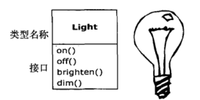
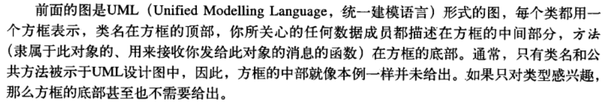
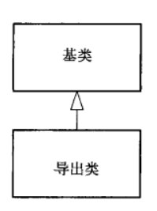
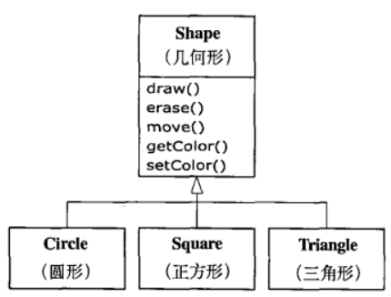
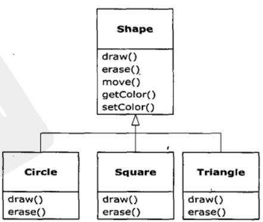
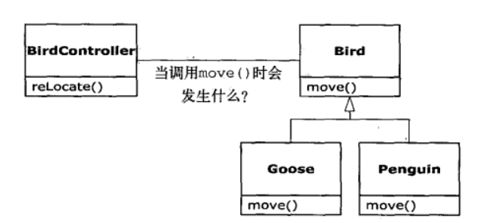

## 面向对象导论

## 1.1 什么是对象

- 万物皆对象。

- 程序是对象的集合。

- 每个对象都有自己的以及由其他对象所构成的存储。

- 每个对象都拥有其类型。

- 某一特定类型的对象可以接受同样的消息。

  每一个对象都属于定义了特性和行为的某个特定的类。

## 1.2 每个对象都有一个接口

​    接口确定了对某一特定对象所能发出的请求。但是，在程序成必须有满足这些请求的代码。这些代码与隐藏的数据一起构成了实现。在类中，每个可能的请求都有一个方法与之相关联，当请求对象发送请求时，与之相关联的方法就会被调用。此过程通常被概括为：某个对象“发送消息”（产生请求），这个对象便知道此消息的目的，然后执行对应的代码。

​    例如一个灯的UML图如下所示：

## 1.3 访问控制

### 1.3.1 为什么要对访问进行控制

1. 让客户端（这里的客户端指的是程序员）无法触及他们不应该触及的部分，而这些部分对数据类型的内部操作来说是必须的。
2. 允许库的设计者可以改变类内部的工作方式而不用担心回影响到客户端程序员。

### 1.3.2 访问权限

|   权限    | 类内 | 同包 | 不同包子类 | 不同包非子类 |
| :-------: | :--: | :--: | :--------: | :----------: |
|  private  |  √   |  ×   |     ×      |      ×       |
|  default  |  √   |  √   |     ×      |      ×       |
| protected |  √   |  √   |     √      |      ×       |
|  public   |  √   |  √   |     √      |      √       |

## 1.4 继承

​    在创建了一个类之后，即使另一个新类与其具有相似的功能，依然需要重新创建一个新类。如果能欧现在的类为基础，复制它，然后通过添加和修改这个副本来创建一个新类就能实现代码的复用。通过集成就可达到此目的。继承的UML图如下所示：

如上所示，UML图中的箭头从子类指向父类。通常一个父类会存在多个子类。

**注意：父类与子类的关系是从一般到具体的过程，并不是包含关系！**

由于基类和导出类（**就是子类**）具有相同的基础接口，所以伴随此接口的必定有某些具体的实现。所以当对象接收到特定的消息时，必须有某些代码去执行。如果只是简单的集成一个类，而不做奇特任何事情，那么在基类就口中的方法将会直接继承到导出类中，不过这样做并没有什么意义。

使基类和导出类存在差异的方法有两种：

- 在导出类中建立一个基类中不存在的方法
- 覆盖（Overriding）基类中的方法

UML如上图所示。

## 1.5 多态

UML图如下所示：

如上图所示：BirdController对象仅仅处理泛化的Bird对象，而不了解它的确切类型。从BirdController的角度看，这么做非常的方便，因为不需要编写特定的代码来判定要处理的Bird对象的确切类型或行为。当move()方法被调用时，计时忽略Bird的具体类型，也会产生正确的行为（Goose（鹅）走，飞或游泳。Penguin（企鹅）走或游泳）。

**多态的本质：就是将导出类型的对象当做其泛华基类调用。**

多态的原理：一个非面向对象的编译器产生的函数调用会引起**前期绑定**。在调用程序时，编译器会产生一个具体函数名字的调用，而运行时将这个调用解析到将要被执行的代码的绝对地址。然而在OOP中，使用了**后期绑定**的概念。当对象发送消息时，被调用的代码知道运行时才能够确定。