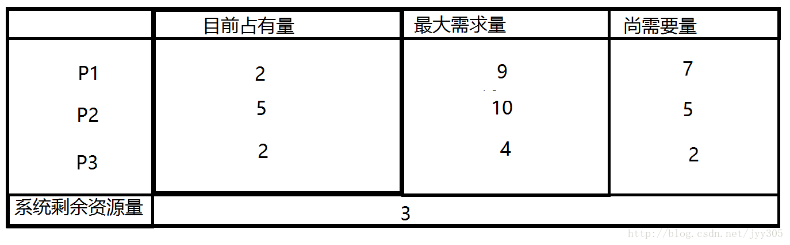
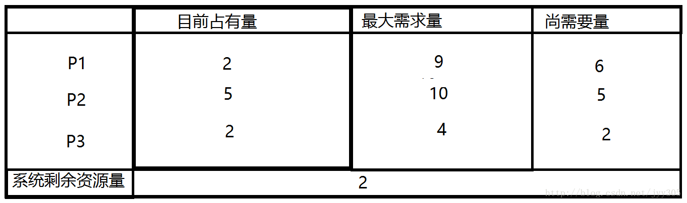

## 死锁产生的四个必要条件

- 互斥条件：资源是独占的且排他使用，进程互斥使用资源，即任意时刻一个资源只能给一个进程使用，其他进程若申请一个资源，而该资源被另一进程占有时，则申请者等待直到资源被占有者释放。
- 不可剥夺条件：进程所获得的资源在未使用完毕之前，不被其他进程强行剥夺，而只能由获得该资源的进程资源释放。
- 请求和保持条件：进程每次申请它所需要的一部分资源，在申请新的资源的同时，继续占用已分配到的资源。
- 循环等待条件：在发生死锁时必然存在一个进程等待队列{P1,P2,…,Pn},其中P1等待P2占有的资源，P2等待P3占有的资源，…，Pn等待P1占有的资源，形成一个进程等待环路，环路中每一个进程所占有的资源同时被另一个申请，也就是前一个进程占有后一个进程所深情地资源。 
  以上给出了导致死锁的四个必要条件，只要系统发生死锁则以上四个条件至少有一个成立。事实上**循环等待**的成立蕴含了前三个条件的成立，似乎没有必要列出然而考虑这些条件对死锁的预防是有利的，因为可以通过破坏四个条件中的任何一个来预防死锁的发生。

## 死锁预防

我们可以通过破坏死锁产生的4个必要条件来 预防死锁，由于资源互斥是资源使用的固有特性是无法改变的。

1. 破坏“不可剥夺”条件：一个进程不能获得所需要的全部资源时便处于等待状态，等待期间他占有的资源将被隐式的释放重新加入到 系统的资源列表中，可以被其他的进程使用，而等待的进程只有重新获得自己原有的资源以及新申请的资源才可以重新启动，执行。
2. 破坏”请求与保持条件“：第一种方法静态分配即每个进程在开始执行时就申请他所需要的全部资源。第二种是动态分配即每个进程在申请所需要的资源时他本身不占用系统资源。
3. 破坏“循环等待”条件：采用资源有序分配其基本思想是将系统中的所有资源顺序编号，将紧缺的，稀少的采用较大的编号，在申请资源时必须按照编号的顺序进行，一个进程只有获得较小编号的进程才能申请较大编号的进程。

## 死锁避免

死锁避免的基本思想：系统对进程发出的每一个系统能够满足的资源申请进行动态检查，并根据检查结果决定是否分配资源，如果分配后系统可能发生死锁，则不予分配，否则予以分配，这是一种保证系统不进入死锁状态的动态策略。 
如果操作系统能保证所有进程在有限时间内得到需要的全部资源，则系统处于安全状态否则系统是不安全的。

1. **安全状态**是指：如果系统存在 由所有的安全序列{P1，P2，…Pn},则系统处于安全状态。一个进程序列是安全的，如果对其中每一个进程Pi(i >=1 && i <= n)他以后尚需要的资源不超过系统当前剩余资源量与所有进程Pj(j < i)当前占有资源量之和，系统处于安全状态则不会发生死锁。

2. **不安全状态**：*如果不存在任何一个安全序列，则系统处于不安全状态*。他们之间的对对应关系如下图所示：

   

    下面我们来通过一个例子对安全状态和不安全状态进行更深的了解  

   

​        如上图所示系统处于安全状态，系统剩余3个资源，可以把其中的2个分配给P3，此时P3已经获得了所有的资源，执行完毕后还能还给系统4个资源，此时系统剩余5个资源所以满足（P2所需的资源不超过系统当前剩余量与P3当前占有资源量之和），同理P1也可以在P2执行完毕后获得自己需要的资源。  如果P1提出再申请一个资源的要求，系统从剩余的资源中分配一个给进程P1，此时系统剩余2个资源，新的状态图如下：那么是否仍是安全序列呢那我们来分析一下  

