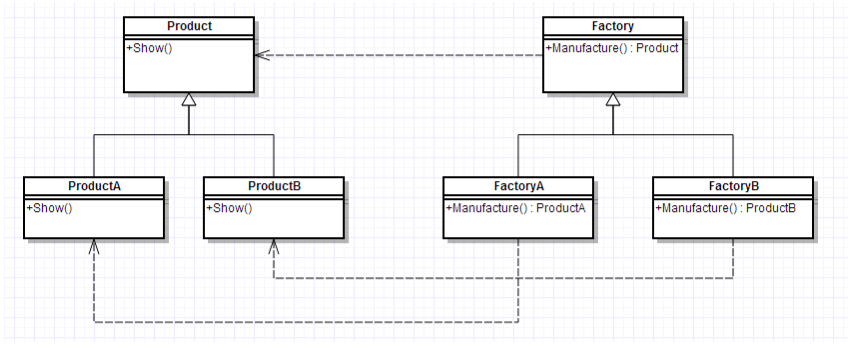

### 工厂方法模式

### 前言

在上文提到的[最易懂的设计模式系列解析：简单工厂模式](http://www.jianshu.com/p/e55fbddc071c)，发现简单工厂模式存在一系列问题：

- 工厂类集中了所有实例（产品）的创建逻辑，一旦这个工厂不能正常工作，整个系统都会受到影响；
- 违背“开放 - 关闭原则”，一旦添加新产品就不得不修改工厂类的逻辑，这样就会造成工厂逻辑过于复杂。
- 简单工厂模式由于使用了静态工厂方法，静态方法不能被继承和重写，会造成工厂角色无法形成基于继承的等级结构。

为了解决上述的问题，我们又使用了一种新的设计模式：工厂方法模式。

> 在阅读下文前强烈建议先阅读[最易懂的设计模式系列解析：简单工厂模式](http://www.jianshu.com/p/e55fbddc071c) 

### 定义

工厂方法模式，又称工厂模式、多态工厂模式和虚拟构造器模式，通过定义工厂父类负责定义创建对象的公共接口，而子类则负责生成具体的对象。

### 主要作用

将类的实例化（具体产品的创建）延迟到工厂类的子类（具体工厂）中完成，即由子类来决定应该实例化（创建）哪一个类。 

### 解决的问题

工厂一旦需要生产新产品就需要修改工厂类的方法逻辑，违背了“开放 - 关闭原则 

> 1. 即**简单工厂模式**的缺点
> 2. 之所以可以解决简单工厂的问题，是因为工厂方法模式把具体产品的创建推迟到工厂类的子类（具体工厂）中，此时工厂类不再负责所有产品的创建，而只是给出具体工厂必须实现的接口，这样工厂方法模式在添加新产品的时候就不修改工厂类逻辑而是添加新的工厂子类，符合开放封闭原则，克服了简单工厂模式中缺点

### UML类图



| 组成（角色）                 | 关系                               | 作用                                                  |
| ---------------------------- | ---------------------------------- | ----------------------------------------------------- |
| 抽象产品（Product）          | 具体产品的父类                     | 描述具体产品的公共接口                                |
| 具体产品（Concrete Product） | 抽象产品的子类；工厂类创建的目标类 | 描述生产的具体产品                                    |
| 抽象工厂（Creator）          | 具体工厂的父类                     | 描述具体工厂的公共接口                                |
| 具体工厂（Concrete Creator） | 抽象工厂的子类；被外界调用         | 描述具体工厂；实现FactoryMethod工厂方法创建产品的实例 |

### 使用步骤

**步骤1：** 创建**抽象工厂类**，定义具体工厂的公共接口；  

**步骤2：** 创建**抽象产品类** ，定义具体产品的公共接口； 

**步骤3：** 创建**具体产品类**（继承抽象产品类） & 定义生产的具体产品；  

**步骤4：**创建**具体工厂类**（继承抽象工厂类），定义创建对应具体产品实例的方法；  

**步骤5：**外界通过调用具体工厂类的方法，从而创建不同**具体产品类的实例** 

### 实例讲解

Factory接口如下：

```java
package com.tang.java.test;

public interface Factory {
    public Prodoct create();
}

```

ProductAFactory实现类：

```java
package com.tang.java.test;

public class ProductAFactory implements Factory {
    public Prodoct create() {
        return new ProductA();
    }
}

```

Product接口:

```java
package com.tang.java.test;

public interface Prodoct {
    public void showName();
    public void setName(String name);
}

```

ProductA实现类：

```java
package com.tang.java.test;

public interface Prodoct {
    public void showName();
    public void setName(String name);
}

```

测试程序：

```java
package com.tang.java.test;

public class Main {
    public static void main(String[] args) {
        Factory factory = new ProductAFactory();
        Prodoct prodoct = factory.create();
        prodoct.setName("Laro");
        prodoct.showName();
    }
}

```

