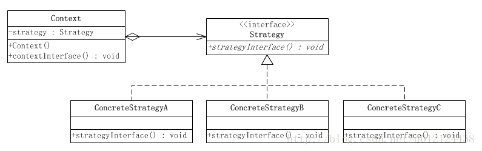

[TOC]

### 策略模式

####  策略模式的定义和使用场景

**定义：**策略模式定义了一系列的算法，并将每一个算法封装起来，而且使他们可以相互替换，让算法独立于使用它的客户而独立变化。

分析下定义，策略模式定义和封装了一系列的算法，它们是可以相互替换的，也就是说它们具有共性，而它们的共性就体现在策略接口的行为上，另外为了达到最后一句话的目的，也就是说让算法独立于使用它的客户而独立变化，我们需要让客户端依赖于策略接口。

**策略模式的使用场景：**

1.针对同一类型问题的多种处理方式，仅仅是具体行为有差别时； 
2.需要安全地封装多种同一类型的操作时； 
3.出现同一抽象类有多个子类，而又需要使用 if-else 或者 switch-case 来选择具体子类时。

#### UML类图



这个模式涉及到三个角色：

环境(Context)角色：持有一个Strategy的引用。

抽象策略(Strategy)角色：这是一个抽象角色，通常由一个接口或抽象类实现。此角色给出所有的具体策略类所需的接口。

具体策略(ConcreteStrategy)角色：包装了相关的算法或行为。

策略模式的典型代码如下：

**抽象策略类** 

```java
public interface Strategy {
    /**
     * 策略方法
     */
    public void strategyInterface();
}
```

**具体策略类** 

```java
public class ConcreteStrategyA implements Strategy {

    @Override
    public void strategyInterface() {
        //相关的业务
    }

}
```

```java
public class ConcreteStrategyB implements Strategy {

    @Override
    public void strategyInterface() {
        //相关的业务
    }

}
```

**环境角色类** 

```java
public class Context {
    //持有一个具体策略的对象
    private Strategy strategy;
    /**
     * 构造函数，传入一个具体策略对象
     * @param strategy    具体策略对象
     */
    public Context(Strategy strategy){
        this.strategy = strategy;
    }
    /**
     * 策略方法
     */
    public void contextInterface(){

        strategy.strategyInterface();
    }

}
```

#### 策略模式例子

假设鹅厂推出了3种会员，分别为会员，超级会员以及金牌会员，还有就是普通玩家，针对不同类别的玩家，购买《王者农药》皮肤有不同的打折方式，并且一个顾客每消费10000就增加一个级别，那么我们就可以使用策略模式，因为策略模式描述的就是算法的不同，这里我们举例就采用最简单的，以上四种玩家分别采用原价（普通玩家），九折，八折和七价的收钱方式。

那么我们首先要有一个计算价格的策略接口

```java
public interface CalPrice {
    //根据原价返回一个最终的价格
    Double calPrice(Double orgnicPrice);
}
```

下面是4种玩家的计算方式的实现 

```java
public class Orgnic implements CalPrice {

    @Override
    public Double calPrice(Double orgnicPrice) {
        return orgnicPrice;
    }
}
```

```java
public class Vip implements CalPrice {
    @Override
    public Double calPrice(Double orgnicPrice) {
        return orgnicPrice * 0.9;
    }
}
```

```java
public class SuperVip implements CalPrice {
    @Override
    public Double calPrice(Double orgnicPrice) {
        return orgnicPrice * 0.8;
    }
}
```

```java
public class GoldVip implements CalPrice {
    @Override
    public Double calPrice(Double orgnicPrice) {
        return orgnicPrice * 0.7;
    }
}
```

我们看客户类，我们需要客户类帮我们完成玩家升级的功能 

```java
public class Player {
    private Double totalAmount = 0D;//客户在鹅厂消费的总额
    private Double amount = 0D;//客户单次消费金额
    private CalPrice calPrice = new Orgnic();//每个客户都有一个计算价格的策略，初始都是普通计算，即原价

    //客户购买皮肤，就会增加它的总额
    public void buy(Double amount) {
        this.amount = amount;
        totalAmount += amount;
        if (totalAmount > 30000) {//30000则改为金牌会员计算方式
            calPrice = new GoldVip();
        } else if (totalAmount > 20000) {//类似
            calPrice = new SuperVip();
        } else if (totalAmount > 10000) {//类似
            calPrice = new Vip();
        }
    }

    //计算客户最终要付的钱
    public Double calLastAmount() {
        return calPrice.calPrice(amount);
    }
}

```

接下来是客户端调用，系统会帮我们自动调整收费策略。 

```java
public class Client {
    public static void main(String[] args) {
        Player player = new Player();
        player.buy(5000D);
        System.out.println("玩家需要付钱：" + player.calLastAmount());
        player.buy(12000D);
        System.out.println("玩家需要付钱：" + player.calLastAmount());
        player.buy(12000D);
        System.out.println("玩家需要付钱：" + player.calLastAmount());
        player.buy(12000D);
        System.out.println("玩家需要付钱：" + player.calLastAmount());
    }
}
```

运行以后会发现，第一次是原价，第二次是九折，第三次是八折，最后一次则是七价。这样设计的好处是，客户不再依赖于具体的收费策略，依赖于抽象永远是正确的。

在上面的基础上，我们可以使用简单工厂来稍微进行优化

```java
public class CalPriceFactory {
    private CalPriceFactory(){}
    //根据客户的总金额产生相应的策略
    public static CalPrice createCalPrice(Player customer){
        if (customer.getTotalAmount() > 30000) {//3000则改为金牌会员计算方式
            return new GoldVip();
        }else if (customer.getTotalAmount() > 20000) {//类似
            return new SuperVip();
        }else if (customer.getTotalAmount() > 10000) {//类似
            return new Vip();
        }else {
            return new Orgnic();
        }
    }
}
```

这样就将制定策略的功能从客户类分离了出来，我们的客户类可以变成这样。 

```java
public class Player {
    private Double totalAmount = 0D;//客户在鹅厂消费的总额
    private Double amount = 0D;//客户单次消费金额
    private CalPrice calPrice = new Orgnic();//每个客户都有一个计算价格的策略，初始都是普通计算，即原价

    //客户购买皮肤，就会增加它的总额
    public void buy(Double amount) {
        this.amount = amount;
        totalAmount += amount;
        /* 变化点，我们将策略的制定转移给了策略工厂，将这部分责任分离出去 */
        calPrice = CalPriceFactory.createCalPrice(this);
    }

    //计算客户最终要付的钱
    public Double calLastAmount() {
        return calPrice.calPrice(amount);
    }

    public Double getTotalAmount() {
        return totalAmount;
    }
}
```

虽然结合简单工厂模式，我们的策略模式灵活了一些，但不免发现在工厂中多了if-else判断，也就是如果增加一个会员类别，我又得增加一个else-if语句，这是简单工厂的缺点，对修改开放。

那有什么方法，可以较好的解决这个问题呢？那就是使用注解， 所以我们需要给注解加入属性上限和下限，用来表示策略生效的区间，用来解决总金额判断的问题。

1.首先我们做一个注解，这个注解是用来给策略添加的，当中可以设置它的上下限

```java
//这是有效价格区间注解，可以给策略添加有效区间的设置
@Target(ElementType.TYPE)//表示只能给类添加该注解
@Retention(RetentionPolicy.RUNTIME)//这个必须要将注解保留在运行时
public @interface PriceRegion {
    int max() default Integer.MAX_VALUE;
    int min() default Integer.MIN_VALUE;
}
```

可以看到，我们只是使用这个注解来声明每一个策略的生效区间，于是对策略进行修改 

```java
@PriceRegion(max = 10000)
public class Orgnic implements CalPrice {

    @Override
    public Double calPrice(Double orgnicPrice) {
        return orgnicPrice;
    }
}
```

```java
@PriceRegion(max=20000)
public class Vip implements CalPrice {
    @Override
    public Double calPrice(Double orgnicPrice) {
        return orgnicPrice * 0.9;
    }
}
```

```java
@PriceRegion(min=20000,max=30000)
public class SuperVip implements CalPrice {
    @Override
    public Double calPrice(Double orgnicPrice) {
        return orgnicPrice * 0.8;
    }
}
```

```java
@PriceRegion(min=3000)
public class GoldVip implements CalPrice {
    @Override
    public Double calPrice(Double orgnicPrice) {
        return orgnicPrice * 0.7;
    }
}
```

接下来就是在策略工厂中去处理注解 

```java
public class CalPriceFactory {
    private static final String CAL_PRICE_PACKAGE = "com.example.stragedemo";//这里是一个常量，表示我们扫描策略的包

    private ClassLoader classLoader = getClass().getClassLoader();

    private List<Class<? extends CalPrice>> calPriceList;//策略列表

    //根据玩家的总金额产生相应的策略
    public CalPrice createCalPrice(Player player) {
        //在策略列表查找策略
        for (Class<? extends CalPrice> clazz : calPriceList) {
            PriceRegion validRegion = handleAnnotation(clazz);//获取该策略的注解
            //判断金额是否在注解的区间
            if (player.getTotalAmount() > validRegion.min() && player.getTotalAmount() < validRegion.max()) {
                try {
                    //是的话我们返回一个当前策略的实例
                    return clazz.newInstance();
                } catch (Exception e) {
                    throw new RuntimeException("策略获得失败");
                }
            }
        }
        throw new RuntimeException("策略获得失败");
    }

    //处理注解，我们传入一个策略类，返回它的注解
    private PriceRegion handleAnnotation(Class<? extends CalPrice> clazz) {
        Annotation[] annotations = clazz.getDeclaredAnnotations();
        if (annotations == null || annotations.length == 0) {
            return null;
        }
        for (int i = 0; i < annotations.length; i++) {
            if (annotations[i] instanceof PriceRegion) {
                return (PriceRegion) annotations[i];
            }
        }
        return null;
    }

    //单例
    private CalPriceFactory() {
        init();
    }

    //在工厂初始化时要初始化策略列表
    private void init() {
        calPriceList = new ArrayList<Class<? extends CalPrice>>();
        File[] resources = getResources();//获取到包下所有的class文件
        Class<CalPrice> calPriceClazz = null;
        try {
            calPriceClazz = (Class<CalPrice>) classLoader.loadClass(CalPrice.class.getName());//使用相同的加载器加载策略接口
        } catch (ClassNotFoundException e1) {
            throw new RuntimeException("未找到策略接口");
        }
        for (int i = 0; i < resources.length; i++) {
            try {
                //载入包下的类
                Class<?> clazz = classLoader.loadClass(CAL_PRICE_PACKAGE + "." + resources[i].getName().replace(".class", ""));
                //判断是否是CalPrice的实现类并且不是CalPrice它本身，满足的话加入到策略列表
                if (CalPrice.class.isAssignableFrom(clazz) && clazz != calPriceClazz) {
                    calPriceList.add((Class<? extends CalPrice>) clazz);
                }
            } catch (ClassNotFoundException e) {
                e.printStackTrace();
            }
        }
    }

    //获取扫描的包下面所有的class文件
    private File[] getResources() {
        try {
            File file = new File(classLoader.getResource(CAL_PRICE_PACKAGE.replace(".", "/")).toURI());
            return file.listFiles(new FileFilter() {
                public boolean accept(File pathname) {
                    if (pathname.getName().endsWith(".class")) {//我们只扫描class文件
                        return true;
                    }
                    return false;
                }
            });
        } catch (URISyntaxException e) {
            throw new RuntimeException("未找到策略资源");
        }
    }

    public static CalPriceFactory getInstance() {
        return CalPriceFactoryInstance.instance;
    }

    private static class CalPriceFactoryInstance {

        private static CalPriceFactory instance = new CalPriceFactory();
    }
}
```

虽然工厂里的逻辑增加了，但是解耦的效果达到了，现在我们随便加入一个策略，并设置好它的生效区间，策略工厂就可以帮我们自动找到适应的策略。 