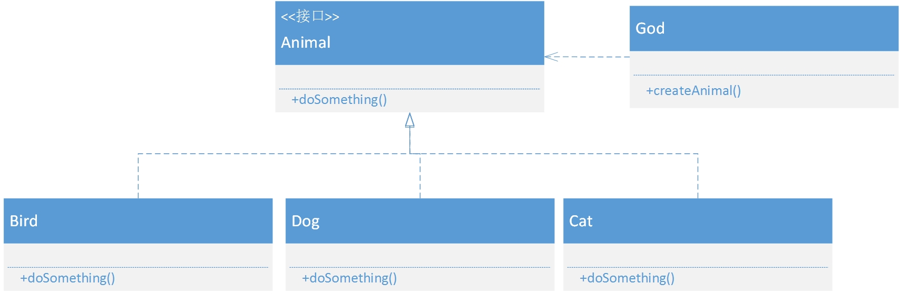

### 简单工厂模式

简单工厂模式又 叫静态工厂方法模式（Static FactoryMethod Pattern）,是通过专门定义一个类来负责创建其他类的实例，被创建的实例通常都具有共同的父类。  我们从一个实例展开  

现在有一道面试题：使用java实现一个计算机控制台程序，要求输入数的运算，得到结果。  这道题目最原始的写法： 

```java
public class Computer {
    public static void main(String[] args) {
        Scanner in = new Scanner(System.in);
        System.out.println("请输入第一个数字：");
        float firstNum  = in.nextFloat();
        System.out.println("请输入第二个数字：");
        float secondNum  = in.nextFloat();
        System.out.println("请输入运算符号：");
        String countQuato = in.next();
        if("+".equals(countQuato)){
            System.out.println("result : "+(firstNum+secondNum));
        }else if("-".equals(countQuato)){
            System.out.println("result : "+(firstNum-secondNum));
        }else if("*".equals(countQuato)){
            System.out.println("result : "+(firstNum*secondNum));
        }else if("/".equals(countQuato)){
            System.out.println("result : "+(firstNum/secondNum));
        }
    }
```

上面的写法实现虽然简单，但是却没有面向对象的特性，代码拓展性差，显然不是出题者想要考察的意图。  那么面向对象编程要如何在题中体现呢？  在面向对象编程语言中，一切都是对象，所以上面运算符号也应当作对象来处理。  我们首先建立一个接口 

```java
public abstract class Operation {

    public abstract float getResult(float firstNumber, float secondNumber);

}
//把符号都当做对象处理，实现此接口
public class AddOperation extends Operation {
    @Override
    public float getResult(float firstNumber, float secondNumber) {
        return firstNumber+secondNumber;
    }

}
public class SubOperation extends Operation {
    @Override
    public float getResult(float firstNumber, float secondNumber) {
        return firstNumber-secondNumber;
    }
}
public class MulOperation extends Operation {
    @Override
    public float getResult(float firstNumber, float secondNumber) {
        return firstNumber*secondNumber;
    }
}
public class DivOperation extends Operation {
    @Override
    public float getResult(float firstNumber, float secondNumber) {
        return firstNumber/secondNumber;
    }
}

//接下来需要解决的就是对象的创建问题了，既如何根据不同的情况创建不同的对象：我们正好可以通过简单工厂模式实现
public class OperationFactory {

    public static Operation getOperation(String quotaFlag){
        Operation o = null;
        switch (quotaFlag){
            case "+" :  o = new AddOperation();
            case "-" :  o = new SubOperation();
            case "*" :  o = new MulOperation();
            case "/" :  o = new DivOperation();
            default:break;
        }
        return o;
    }
}
//调用：
public class Computer {
    public static void main(String[] args) {
        Scanner in = new Scanner(System.in);
        System.out.println("请输入第一个数字：");
        float firstNum  = in.nextFloat();
        System.out.println("请输入第二个数字：");
        float secondNum  = in.nextFloat();
        System.out.println("请输入运算符号：");
        String countQuato = in.next();
        System.out.println(count(firstNum,secondNum,countQuato));
    }
    private static float count(float firstNum,float secondNum , String countQuota){
    //通过工厂类获取对象
        Operation operation = OperationFactory.getOperation(countQuota);
        return operation.getResult(firstNum,secondNum);
    }
}
```

简单工厂将对象的创建过程进行了封装，用户不需要知道具体的创建过程，只需要调用工厂类获取对象即可。

这种简单工厂的写法是通过switch-case来判断对象创建过程的。在实际使用过程中，违背了 开放-关闭原则。

再来一个实例：

案例描述：

类：上帝（God类，其实就是一个工厂，用于创造小狗，小猫和小鸟），小狗（Dog）、小猫（Cat）、小鸟（Bird）

接口：动物（Animal）

UML图如下所示:



以下是代码实现：

```java
package com.tang.java.test;

import java.util.HashMap;

public class God {

    private HashMap<String, Integer> map;

    {
        String[] key = new String[]{"小猫", "小狗", "小鸟"};
        Integer[] value = new Integer[]{0, 1, 2};
        map = new HashMap();
        for (int i = 0; i < key.length; i++) {
            map.put(key[i], value[i]);
        }
    }

    public Animal createAnimal(String name) {

        switch (map.get(name)) {
            case 0: {
                return new Cat();
            }
            case 1: {
                return new Dog();
            }
            case 2: {
                return new Bird();
            }
        }
        return null;
    }
}
package com.tang.java.test;

import java.util.HashMap;

public class God {

    private HashMap<String, Integer> map;

    {
        String[] key = new String[]{"小猫", "小狗", "小鸟"};
        Integer[] value = new Integer[]{0, 1, 2};
        map = new HashMap();
        for (int i = 0; i < key.length; i++) {
            map.put(key[i], value[i]);
        }
    }

    public Animal createAnimal(String name) {

        switch (map.get(name)) {
            case 0: {
                return new Cat();
            }
            case 1: {
                return new Dog();
            }
            case 2: {
                return new Bird();
            }
        }
        return null;
    }
}
package com.tang.java.test;

public class Bird implements Animal {
    public void doSomething() {
        System.out.println("小鸟喳喳");
    }
}
package com.tang.java.test;

public class Dog implements Animal {
    public void doSomething() {
        System.out.println("小狗汪汪");
    }
}
package com.tang.java.test;

public class Test1 {
    public static void main(String[] args) {
        God god = new God();
        Animal animal = god.createAnimal("小猫");
        animal.doSomething();
        animal = god.createAnimal("小狗");
        animal.doSomething();
        animal = god.createAnimal("小鸟");
        animal.doSomething();
    }
}
```

