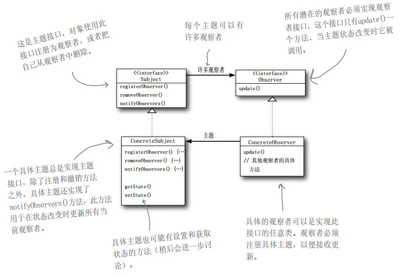
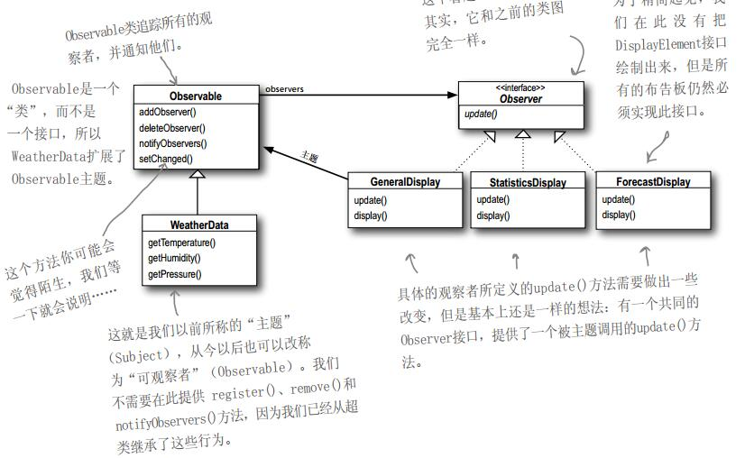

### 观察者模式

观察者模式适用于经常变化且需要被监测的对象。课本上举的例子是气象站的一个类WebData，这个Webdata能获得最新的气象数据并及时的更新到三个布告板。布告板也不能仅仅只有3个，知识说现在有三个， 以后可能会有更多的布告板展示其他的数据（可拓展性）。

怎么办呢？

基本的过程呢，我们用一个简单的例子来解释：假设观察者是订阅报纸的人，简称狗，鸭子，猫和老鼠，他们都订阅了某个报社的报纸（假设鸭子还没订阅）。而被订阅的报社呢，是被观察者，就叫他们报社。整体的工作流程如下：

某天，鸭子向报社说，我想订阅一份报纸（鸭子相当观察者了），这个过程称作注册；

报社街道订阅通知，将鸭子添加到自己的订阅列表；

好，现在鸭子也加入到了观察者里面，开始等待报社送报纸（发送通知）；

报社印出了新的报纸，并告诉观察者们报纸已经好了；

老鼠不想当观察者了，想订阅另一个报社的报纸，于是老鼠向报社发送请求，然后老鼠离开了，删除了一个观察者。

报社又产生了新的报纸，只不过老鼠已经接收不到通知了。

那么我们基本就了解了观察者模式的工作流程了，那么观察者模式应该具体怎么实现呢？我们来看类图



一定要注意这几个方法，对于被观察者（主题，Subject），registerObserver，RemoveObserver，NotifyObserver，对于观察者，只需要一个update。这是一个松耦合的设计，观察者只需要等待主题的通知，而主题只知道观察者只有一个update 方法。剩下的就比较简单了。你可以写一个Client类，这个类通过持有观察者和被观察者两个接口，不断的向被观察者内部注册观察者或者移除观察者。或者当被观察者需要通知观察者时，由Client调用notifyObservers（）方法。

java内部实现了观察者模式，Observervable抽象类负责被观察者，Observer接口负责观察者，如下图所示



下面先看下手动实现的观察者模式：

观察者接口：

```java
package com.tang.java.test;

public interface Observer {
    public void update();
}
```

观察者实现类：

```java
package com.tang.java.test;

public class ObserverTest implements Observer {
    String name;

    public ObserverTest() {
    }

    public ObserverTest(String name) {
        this.name = name;
    }

    public void update() {
        System.out.println(name + "检测到了目标的变化！");
    }

    public String getName() {
        return name;
    }

    public void setName(String name) {
        this.name = name;
    }
}
```

观察目标接口：

```java
package com.tang.java.test;

public interface Subject {
    public void attach(Observer observer);
    public void detach(Observer observer);
    public void notifyObserver();
}
```

观察目标实现类：

```java
package com.tang.java.test;

import java.util.ArrayList;

public class SubjectTest implements Subject {
    ArrayList<Observer> observers = null;

    public SubjectTest() {
        this.observers = new ArrayList<Observer> ();
    }

    public void attach(Observer observer) {
        this.observers.add(observer);
    }

    public void detach(Observer observer) {
        this.observers.remove(observer);
    }

    public void notifyObserver() {
        for(Observer o : this.observers){
            o.update();
        }
    }
}
```

测试程序：

```java
package com.tang.java.test;

public class Main {
    public static void main(String[] args) {
        Subject subject = new SubjectTest();
        ObserverTest observerTest1 = new ObserverTest("唐泽宇");
        ObserverTest observerTest2 = new ObserverTest("laro");

        subject.attach(observerTest1);
        subject.attach(observerTest2);
        subject.notifyObserver();
    }
}
```

输出结果：

```java
唐泽宇检测到了目标的变化！
laro检测到了目标的变化！
唐泽宇检测到了目标的变化！
laro检测到了目标的变化！
```

Java提供的观察者模式源码：

Observable：

```java
/*
 * Copyright (c) 1994, 2012, Oracle and/or its affiliates. All rights reserved.
 * ORACLE PROPRIETARY/CONFIDENTIAL. Use is subject to license terms.
 *
 *
 *
 *
 *
 *
 *
 *
 *
 *
 *
 *
 *
 *
 *
 *
 *
 *
 *
 *
 */

package java.util;

/**
 * This class represents an observable object, or "data"
 * in the model-view paradigm. It can be subclassed to represent an
 * object that the application wants to have observed.
 * <p>
 * An observable object can have one or more observers. An observer
 * may be any object that implements interface <tt>Observer</tt>. After an
 * observable instance changes, an application calling the
 * <code>Observable</code>'s <code>notifyObservers</code> method
 * causes all of its observers to be notified of the change by a call
 * to their <code>update</code> method.
 * <p>
 * The order in which notifications will be delivered is unspecified.
 * The default implementation provided in the Observable class will
 * notify Observers in the order in which they registered interest, but
 * subclasses may change this order, use no guaranteed order, deliver
 * notifications on separate threads, or may guarantee that their
 * subclass follows this order, as they choose.
 * <p>
 * Note that this notification mechanism has nothing to do with threads
 * and is completely separate from the <tt>wait</tt> and <tt>notify</tt>
 * mechanism of class <tt>Object</tt>.
 * <p>
 * When an observable object is newly created, its set of observers is
 * empty. Two observers are considered the same if and only if the
 * <tt>equals</tt> method returns true for them.
 *
 * @author  Chris Warth
 * @see     java.util.Observable#notifyObservers()
 * @see     java.util.Observable#notifyObservers(java.lang.Object)
 * @see     java.util.Observer
 * @see     java.util.Observer#update(java.util.Observable, java.lang.Object)
 * @since   JDK1.0
 */
public class Observable {
    private boolean changed = false;
    private Vector<Observer> obs;

    /** Construct an Observable with zero Observers. */

    public Observable() {
        obs = new Vector<>();
    }

    /**
     * Adds an observer to the set of observers for this object, provided
     * that it is not the same as some observer already in the set.
     * The order in which notifications will be delivered to multiple
     * observers is not specified. See the class comment.
     *
     * @param   o   an observer to be added.
     * @throws NullPointerException   if the parameter o is null.
     */
    public synchronized void addObserver(Observer o) {
        if (o == null)
            throw new NullPointerException();
        if (!obs.contains(o)) {
            obs.addElement(o);
        }
    }

    /**
     * Deletes an observer from the set of observers of this object.
     * Passing <CODE>null</CODE> to this method will have no effect.
     * @param   o   the observer to be deleted.
     */
    public synchronized void deleteObserver(Observer o) {
        obs.removeElement(o);
    }

    /**
     * If this object has changed, as indicated by the
     * <code>hasChanged</code> method, then notify all of its observers
     * and then call the <code>clearChanged</code> method to
     * indicate that this object has no longer changed.
     * <p>
     * Each observer has its <code>update</code> method called with two
     * arguments: this observable object and <code>null</code>. In other
     * words, this method is equivalent to:
     * <blockquote><tt>
     * notifyObservers(null)</tt></blockquote>
     *
     * @see     java.util.Observable#clearChanged()
     * @see     java.util.Observable#hasChanged()
     * @see     java.util.Observer#update(java.util.Observable, java.lang.Object)
     */
    public void notifyObservers() {
        notifyObservers(null);
    }

    /**
     * If this object has changed, as indicated by the
     * <code>hasChanged</code> method, then notify all of its observers
     * and then call the <code>clearChanged</code> method to indicate
     * that this object has no longer changed.
     * <p>
     * Each observer has its <code>update</code> method called with two
     * arguments: this observable object and the <code>arg</code> argument.
     *
     * @param   arg   any object.
     * @see     java.util.Observable#clearChanged()
     * @see     java.util.Observable#hasChanged()
     * @see     java.util.Observer#update(java.util.Observable, java.lang.Object)
     */
    public void notifyObservers(Object arg) {
        /*
         * a temporary array buffer, used as a snapshot of the state of
         * current Observers.
         */
        Object[] arrLocal;

        synchronized (this) {
            /* We don't want the Observer doing callbacks into
             * arbitrary code while holding its own Monitor.
             * The code where we extract each Observable from
             * the Vector and store the state of the Observer
             * needs synchronization, but notifying observers
             * does not (should not).  The worst result of any
             * potential race-condition here is that:
             * 1) a newly-added Observer will miss a
             *   notification in progress
             * 2) a recently unregistered Observer will be
             *   wrongly notified when it doesn't care
             */
            if (!changed)
                return;
            arrLocal = obs.toArray();
            clearChanged();
        }

        for (int i = arrLocal.length-1; i>=0; i--)
            ((Observer)arrLocal[i]).update(this, arg);
    }

    /**
     * Clears the observer list so that this object no longer has any observers.
     */
    public synchronized void deleteObservers() {
        obs.removeAllElements();
    }

    /**
     * Marks this <tt>Observable</tt> object as having been changed; the
     * <tt>hasChanged</tt> method will now return <tt>true</tt>.
     */
    protected synchronized void setChanged() {
        changed = true;
    }

    /**
     * Indicates that this object has no longer changed, or that it has
     * already notified all of its observers of its most recent change,
     * so that the <tt>hasChanged</tt> method will now return <tt>false</tt>.
     * This method is called automatically by the
     * <code>notifyObservers</code> methods.
     *
     * @see     java.util.Observable#notifyObservers()
     * @see     java.util.Observable#notifyObservers(java.lang.Object)
     */
    protected synchronized void clearChanged() {
        changed = false;
    }

    /**
     * Tests if this object has changed.
     *
     * @return  <code>true</code> if and only if the <code>setChanged</code>
     *          method has been called more recently than the
     *          <code>clearChanged</code> method on this object;
     *          <code>false</code> otherwise.
     * @see     java.util.Observable#clearChanged()
     * @see     java.util.Observable#setChanged()
     */
    public synchronized boolean hasChanged() {
        return changed;
    }

    /**
     * Returns the number of observers of this <tt>Observable</tt> object.
     *
     * @return  the number of observers of this object.
     */
    public synchronized int countObservers() {
        return obs.size();
    }
}

```

Observer:

```java
package java.util;

/**
 * A class can implement the <code>Observer</code> interface when it
 * wants to be informed of changes in observable objects.
 *
 * @author  Chris Warth
 * @see     java.util.Observable
 * @since   JDK1.0
 */
public interface Observer {
    /**
     * This method is called whenever the observed object is changed. An
     * application calls an <tt>Observable</tt> object's
     * <code>notifyObservers</code> method to have all the object's
     * observers notified of the change.
     *
     * @param   o     the observable object.
     * @param   arg   an argument passed to the <code>notifyObservers</code>
     *                 method.
     */
    void update(Observable o, Object arg);
}
```

使用案例如下：

Subject实现类：

```java
package com.tang.java.test;


import java.util.Observable;

public class SubjectTest extends Observable {
    public void toChange() {
        this.setChanged();
    }
}

```

Observer实现类：

```java
package com.tang.java.test;

import java.util.Observable;
import java.util.Observer;

public class ObserverTest implements Observer {
    private String name;

    public ObserverTest() {
    }

    public ObserverTest(String name) {
        this.name = name;
    }

    public void update(Observable o, Object arg) {
        System.out.println(name + "接收到消息");
    }

    public String getName() {
        return name;
    }

    public void setName(String name) {
        this.name = name;
    }
}

```

测试代码：

```java
package com.tang.java.test;

public class Main {
    public static void main(String[] args) {
        SubjectTest subjectTest = new SubjectTest();

        ObserverTest observerTest = new ObserverTest("唐泽宇");
        subjectTest.addObserver(observerTest);
        subjectTest.toChange();
        subjectTest.notifyObservers();
    }
}
```

